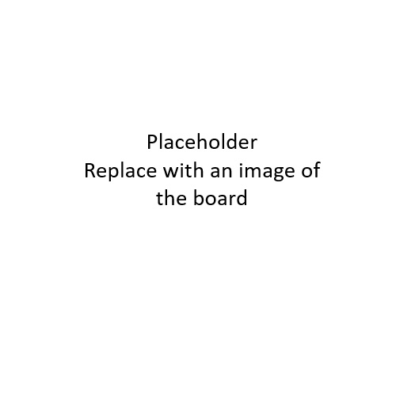

# Part Number + Name
Describe the board here, make sure you mention the BLE SoC part number and the LoRa transceiver part number

 

    

 

## Pin Table
The table below is copied from SWT-043A-01. For each board put a pin table describing the GPIOs.

Exposed - Whether the GPIO is routed to a pin header  
Used    - Whether the GPIO is used for something already on the board  
Note: USED pins cannot be remapped to other functions without breaking core functionality, e.g. below PD00 and PD01 are XTAL pins are required for BLE to work properly. Other USED pins can be remapped, e.g. a user button can be remapped to I2C.   
Make sure to describe which pins can be remapped. 

|HW Pin|GPIO Pin|Used |Exposed|Description|
|------|--------|-----|-------|-----------|
|1     |PC00    |TRUE |TRUE   |USER LED   |
|2     |PC01    |FALSE|TRUE   |           |
|3     |PC02    |FALSE|TRUE   |           |
|4     |PC03    |FALSE|TRUE   |           |
|5     |PC04    |FALSE|TRUE   |           |
|6     |PC05    |TRUE |TRUE   |PTI DATA   |
|7     |PC06    |TRUE |TRUE   |PTI FRAME  |
|8     |PC07    |TRUE |TRUE   |USER BUTTON|
|16    |PB04    |FALSE|TRUE   |           |
|17    |PB03    |FALSE|TRUE   |           |
|18    |PB02    |FALSE|TRUE   |           |
|19    |PB01    |FALSE|TRUE   |           |
|20    |PB00    |TRUE |TRUE   |RF SW      |
|21    |PA00    |TRUE |TRUE   |LORA_NSS   |
|22    |PA01    |TRUE |FALSE  |SWDCLK     |
|23    |PA02    |TRUE |FALSE  |SWDIO      |
|24    |PA03    |TRUE |TRUE   |LORA_SCK   |
|25    |PA04    |TRUE |TRUE   |LORA_MOSI  |
|26    |PA05    |TRUE |TRUE   |LORA_MISO  |
|27    |PA06    |TRUE |TRUE   |LORA_RESET |
|28    |PA07    |TRUE |TRUE   |LORA_BUSY  |
|29    |PA08    |TRUE |TRUE   |LORA_DIO1  |
|37    |PD00    |TRUE |FALSE  |XTAL_OUT   |
|38    |PD01    |TRUE |FALSE  |XTAL_IN    |
|39    |PD02    |TRUE |TRUE   |DBG_UART_TX|
|40    |PD03    |TRUE |TRUE   |DBG_UART_RX|
